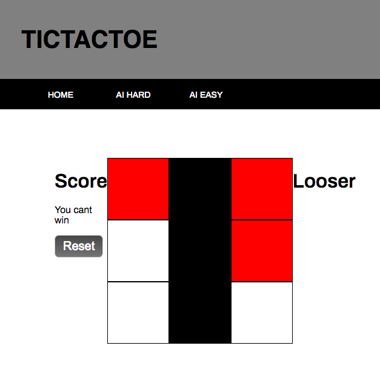

# Project 0

## Tic Tac Toe

A tic tac toe game with multiplayer options aswell as a single player mode to compete against two different levels of ai.

##### link to live site

https://quantumfishcake.github.io/TicTacToe/

##### Preview

 

### How to play
You will be provided three options upon starting the game. 2Player, AI Hard and Ai Easy. 2Player allows two people to play against each other on a board of any size. The default size for this board will be 5 but to change, simply input a new number and click reset to create your new game. AI Hard is a single player mode that allows you to compete against the computer. You can not win in this mode and if you do, something is bugged. Ai Easy puts you against a simpler AI.

#### libraries Used

1. Jquery
2. Mathjs

### AI logic

**AI Hard** works by checking for winning spots followed by spots that will block the human and if it fails to meet those conditions it will pick a spot based on a small priority of middle--> corners followed lastly by a random spot.
**AI Easy** Simply checks if the computer can win or block the player from winning with their next move, otherwise it will pick a random spot.

####Ackowledgments
-- slide bar courtesy of soheil
